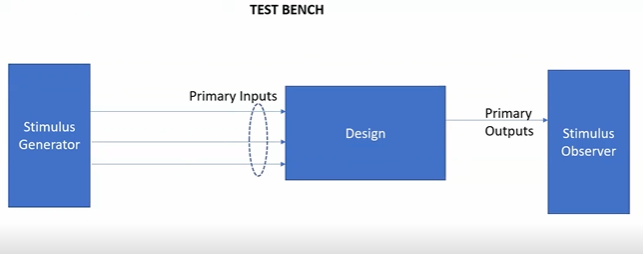

<h2> Day 1 Introduction to Verilog RTL and Synthesis. </h2>

<h3> Environment Setup </h3>

```
mkdir work
cd work

Install VSD flow from the below repo
https://github.com/kunalg123/vsdflow.git

Clone the workshop files from the below repo
https://github.com/kunalg123/sky130RTLDesignAndSynthesisWorkshop.git


```

<h3> Simulation and Synthesis of a basic 2X1 MUX </h3>

<p> We first simulate our RTL code using iverilog simulator and then move ahead with synthesis after evaluation with the test bench. The Synthesis tool used is Yosys which is an open source synthesizer. After we synthesize the design, yosys output a netlist file. Basically our RTL code which is the behavioral representation of the logic written using verilog is first tested using a test bench. After the test cases are passed, it is then synthesized into a netlist based on the PDK used. The netlist is simply the representation of behavioral logic from RTL using the standard cells and gates available in the PDK. After generation of the netlist which is also a verilog code but with standard cells we can use the same test bench to test netlist also.</p>

<h3> Simulation process flow  digaram</h3>

The test bench generates a stimulus file to test the DUT.



The simulation flow is given below. Iverilog takes a design under test and a test bench to generate a value change dump which can be displayed using gtkwave.


<h3> Synthesis process flow  digaram</h3>

The synthesizer takes the design and set of libraries based on the PDK to create a netlist file.


Testing of this netlist is done using the same verilog test bench as below


<h3> Example of the flow </h3>

```
//good_mux.v

module good_mux (input i0 , input i1 , input sel , output reg y);
always @ (*)
begin
        if(sel)
                y <= i1;
        else
                y <= i0;
end
endmodule

```
Test bench

```
tb_good_mux.v
timescale 1ns / 1ps
module tb_good_mux;
        // Inputs
        reg i0,i1,sel;
        // Outputs
        wire y;

        // Instantiate the Unit Under Test (UUT)
        good_mux uut (
                .sel(sel),
                .i0(i0),
                .i1(i1),
                .y(y)
        );

        initial begin
        $dumpfile("tb_good_mux.vcd");
        $dumpvars(0,tb_good_mux);
        // Initialize Inputs
        sel = 0;
        i0 = 0;
        i1 = 0;
        #300 $finish;
        end

always #75 sel = ~sel;
always #10 i0 = ~i0;
always #55 i1 = ~i1;
endmodule


```

Testing 

Simulation
```
iverilog good_mux.v tb_good_mux.v
This creates an .out file
./a.out
This command creates a value change dump file.
gtkwave <VCD file name>
This displays the results in wave format.
```


Synthesis

```
yosys
This opens the yosys terminal
read_liberty -lib ../my_lib/lib/sky130_fd-sc_hd_tt_025C_1v80.lib
read_verilog good_mux.v
synth -top good_mux
abc -liberty ../my_lib/lib/sky130_fd-sc_hd_tt_025C_1v80.lib
show 
This displays the netlist
write_verilog -noattr good_mux_netlist.v
To write the netlist in a verilog file.
```

