<h2> Day 2 Timing libs, hierarchical vs flat synthesis and efficient flop coding styles. </h2>

<h3> Hierarachical Synthesis Vs Flat Synthesis </h3>

The hierarchical synthesis divides the entire design by submodules and generates a netlist for each of the submodules.

<h4> Example </h4>

```
//multiple_modules.v

module sub_module2 (input a, input b, output y);
        assign y = a | b;
endmodule

module sub_module1 (input a, input b, output y);
        assign y = a&b;
endmodule


module multiple_modules (input a, input b, input c , output y);
        wire net1;
        sub_module1 u1(.a(a),.b(b),.y(net1));  //net1 = a&b
        sub_module2 u2(.a(net1),.b(c),.y(y));  //y = net1|c ,ie y = a&b + c;
endmodule

```
Once we synthesize the top modules using "synth -top multiple_modules" the above, the hierarchical representation is preserved. We get the netlist as below.

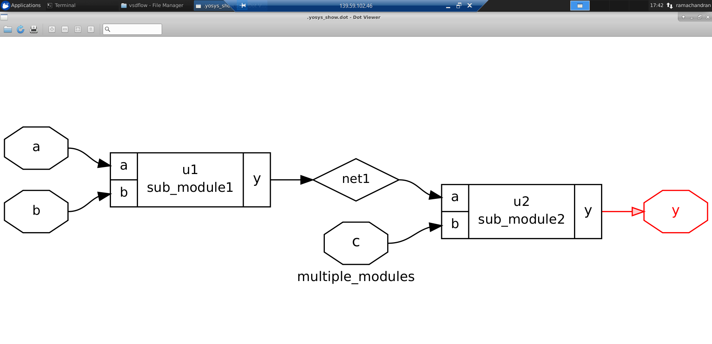

This divide and conquer approach is useful for solving complicated design wherein we can synthesize and test the submodules and finally integrate all in the final netlist.

On synthesis of sub module 1:

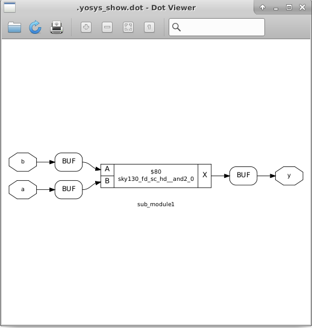

On synthesis of sub module 2:

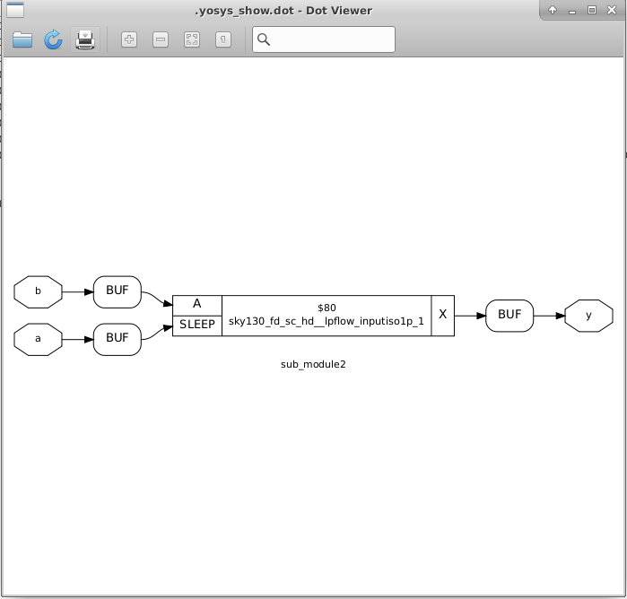

We can remove this hierarchical simulation using the "flatten" command after the netlist generation and we get as below.

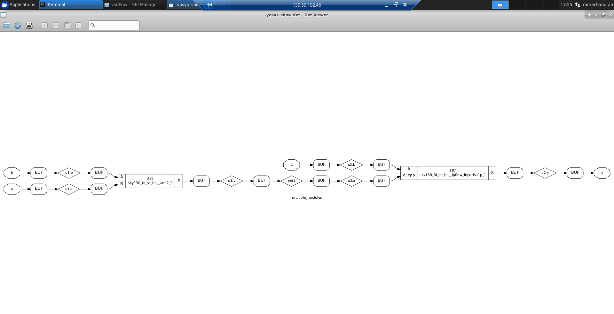


<h3> Flop coding Styles </h3>

Flip flops are used to speed up the clock frequency by storing the intermediate results of slower combinational circuits. These are helpful to achieve pipelining and thereby increasing the clock frequency, by reducing the delay in combinational logic computation through splitting the logic into smaller parts and storing the intermediate result to be useful by the next part.

<h4> D-Flip flop using Async reset </h4>

In this circuit, the D flip flop has a reset signal which does not depend on clock. Whenever we apply a high value to reset signal, the flop resets irrespective of the edge of the clock.

```
//dff_asyncres.v

module dff_asyncres ( input clk ,  input async_reset , input d , output reg q );
always @ (posedge clk , posedge async_reset)
begin
	if(async_reset)
		q <= 1'b0;
	else	
		q <= d;
end
endmodule
```

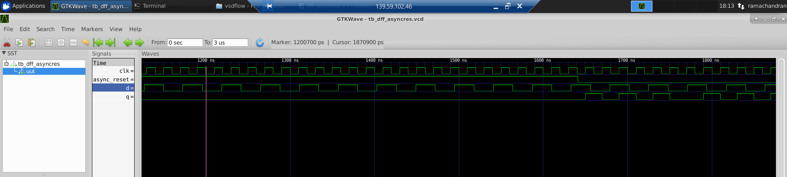

Here we can also see that irrespective of time at which the reset is turned off, the flop changes its value only in the rising edge. The netlist after synthesis is as below.

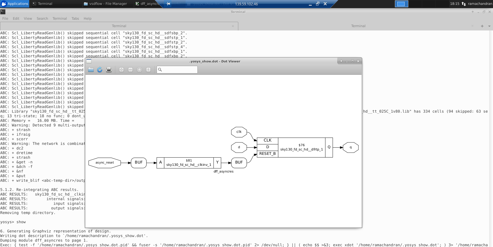

<h4> D-Flip flop using Async set </h4>

This is similar to previous circuit,but when the set signal is high, irrespective of the edge of clock, the flop output becomes high.

```
//dff_async_set.v
module dff_async_set ( input clk ,  input async_set , input d , output reg q );
always @ (posedge clk , posedge async_set)
begin
        if(async_set)
                q <= 1'b1;
        else
                q <= d;
end
endmodule

```
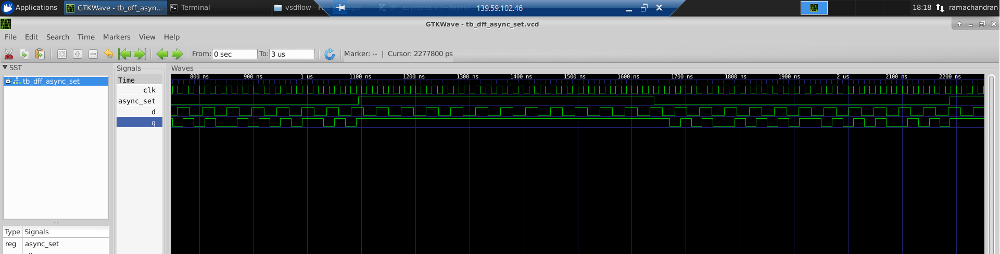

The synthesized netlist is as below.

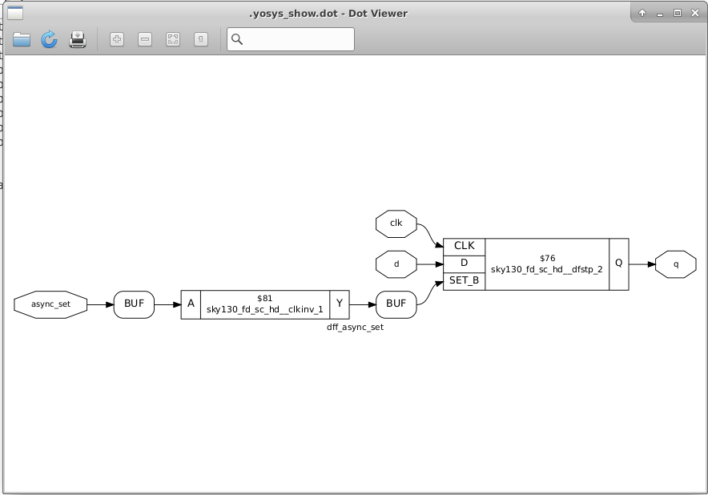

Here the Sky130 pdk has a reset or set signal with active low operation. Since we use active high to enable it there is an inverter in the circuit.

<h4> D-Flip flop using Sync reset </h4>

This D flip flop has all the inputs and control signals synchronized with the clock. So irrespective of when we  apply a reset signal signal, the reset occurs in the coming raising edge of clock.

```
//dff_syncres.v
module dff_syncres ( input clk , input async_reset , input sync_reset , input d , output reg q );
always @ (posedge clk )
begin
        if (sync_reset)
                q <= 1'b0;
        else
                q <= d;
end
endmodule

```
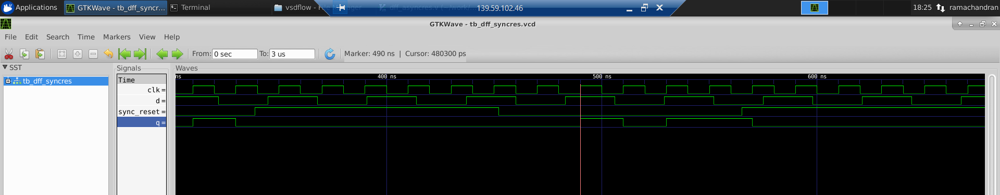

The synthesized netlist is as below.

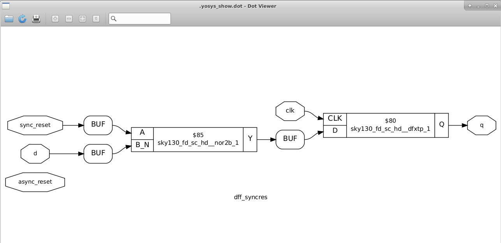

<h4> Interesting optimizations 1 </h4>

Here we take the example of multipler circuit which performs a multiplication of 2 with the input signal which is of 3 bits. The truth is as below.

output = input * 2;

|input[2] |input[1]  | input[0]| output[3] |output[3]  | output[1]| output[0] | 
--- | --- | --- | --- | --- | --- | ---
|0|0|0|0|0|0|0
|0|0|1|0|0|1|0
|0|1|0|0|1|0|0
|0|1|1|0|1|1|0
|1|0|0|1|0|0|0
|1|0|1|1|0|1|0
|1|1|0|1|1|0|0
|1|1|1|1|1|1|0

Clearly we can see from the above truth table that ouput is same as input with 0 in LSB. So we don't need any circuit to implement this functionality.


```
mult_2.v
module mul2 (input [2:0] a, output [3:0] y);
        assign y = a * 2;
endmodule

```
On synthesis we can see the same optimization.

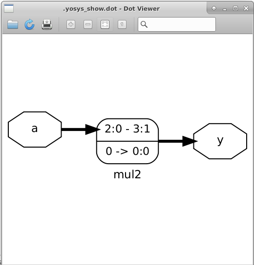


<h4> Interesting optimizations 2 </h4>

Here we have circuit which performs a muliplication of input with 9.

y = a * 9;
y = a * (8+1);
y = a * 8 + a * 1;
a * 8 => a followed by 3 zeros in LSB which is a000
when we add it with a the 3 LSB bits becomes a.
y = {a,a} concatnetaion of a and a. Thus no logic is needed here.

On synthesis we can see the same optimization.

```
//mult_8.v
module mult8 (input [2:0] a , output [5:0] y);
        assign y = a * 9;
endmodule
```

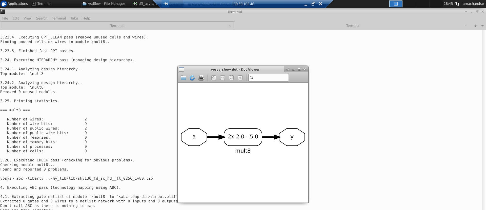
