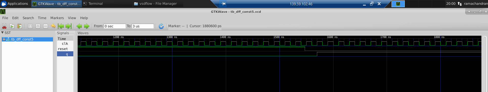

<h2>Day 3 - Combinational and sequential optmizations. </h2>

In this section we will be focussing on various optimization examples of combinational and sequential circuits.

<h2> Combinational circuit optimizations </h2>

The combination circuits can be optimized in the below techniques.

<UL>
<LI>Squeezing the logic </LI>
<LI>Constant Propagation </LI>
<LI>Boolean Logic Optimization </LI>
</UL>

First are the examples for constant propagation. Whenever we have constant at inputs we can perfrom optimizations and reduce the logic.

<h4> Example 1 </h4>

```
//opt_check.v
module opt_check (input a , input b , output y);
        assign y = a?b:0;
endmodule

```
Since the MUX expression can be written as 
y = !A . 0 + A.B
y = AB.

Thus we reduce down to and gate when we have an 0 as one input. On synthesis using yosys we get the below netlist.


<h4> Example 2</h4>

```
//opt_check2.v
module opt_check2 (input a , input b , output y);
        assign y = a?1:b;
endmodule

```
The MUX can be written as 
y = !A.B + A.1
On reducing y = A + B 
Thus we don't need a mux rather an OR will be sufficient.


<h4> Example 3 </h4>

```
//opt_check3.v
module opt_check3 (input a , input b, input c , output y);
        assign y = a?(c?b:0):0;
endmodule

```
The MUX can be written as 
y = !A.0 + A[!C.0 + C.B]
y = 0 + ABC
Thus an AND will be enough in this case.On synthesis using yosys.


<h4> Example 4 </h4>

```
//opt_check4.v
module opt_check4 (input a , input b , input c , output y);
 assign y = a?(b?(a & c ):c):(!c);
 endmodule
```
The expression can be rewritten as below

y = !A!C + A. (!B.C + B.(A.C))
y = !A!C + A.!B.C + A.B.C
y = !A!C + A.C
y = A XNOR C

On synthesis using yosys we get the above optimization.


<h4> Example 5 </h4>

Here we perform optimization on a hierarchical structure.

```
//multiple_module_opt.v
module sub_module1(input a , input b , output y);
 assign y = a & b;
endmodule


module sub_module2(input a , input b , output y);
 assign y = a^b;
endmodule


module multiple_module_opt(input a , input b , input c , input d , output y);
wire n1,n2,n3;

sub_module1 U1 (.a(a) , .b(1'b1) , .y(n1));
sub_module2 U2 (.a(n1), .b(1'b0) , .y(n2));
sub_module2 U3 (.a(b), .b(d) , .y(n3));

assign y = c | (b & n1);


endmodule

```

On synthesis using yosys we get the below netlist.


<h4> Example 6 </h4>

```
//multiple_module_opt2.v
module sub_module(input a , input b , output y);
 assign y = a & b;
endmodule


module multiple_module_opt2(input a , input b , input c , input d , output y);
wire n1,n2,n3;

sub_module U1 (.a(a) , .b(1'b0) , .y(n1));
sub_module U2 (.a(b), .b(c) , .y(n2));
sub_module U3 (.a(n2), .b(d) , .y(n3));
sub_module U4 (.a(n3), .b(n1) , .y(y));


endmodule
```

On synthesis using Yosys we get the below netlist.


<h2> Sequential circuit optimizations </h2>

In Sequential circuit optimizations, we use the below techniques to perform optimization.

<UL>
<LI>Basic </LI>
<UL>
<LI>Sequential constant propagation. </LI>
</UL>
<LI>Advanced </LI>
<UL>
<LI>State optimization</LI>
<LI>Retiming</LI>
<LI>Sequential Logic Cloning</LI>
</UL>
</UL>

<h4> Example 1 </h4>

```
//dff_const1.v
module dff_const1(input clk, input reset, output reg q);
always @(posedge clk, posedge reset)
begin
        if(reset)
                q <= 1'b0;
        else
                q <= 1'b1;
end

endmodule

```
The simulated results are as below.


On synthesis using yosys we get the netlist,Here not much of optimization can be done.


<h4> Example 2</h4>

```
//dff_const2.v
module dff_const2(input clk, input reset, output reg q);
always @(posedge clk, posedge reset)
begin
        if(reset)
                q <= 1'b1;
        else
                q <= 1'b1;
end

endmodule

```


From the wave diagram we can see the output is always constan and so our netlist is as below.


<h4> Exampe 3 </h4>

```
//dff_const3.v
module dff_const3(input clk, input reset, output reg q);
reg q1;

always @(posedge clk, posedge reset)
begin
        if(reset)
        begin
                q <= 1'b1;
                q1 <= 1'b0;
        end
        else
        begin
                q1 <= 1'b1;
                q <= q1;
        end
end

endmodule

```


Here we have 2 flip flops one is reset flop and other is set flop. Both reset and set are connected to reset line. When the reset is high the q1 of first flop is low and q of second flop is set high. When it becomes low the value of q1 from first flop is passed to second flop making q to 0 for a one cycle and in the next cycle, the value of q1 is passed to q, the q becomes high.


<h4>Example 4 </h4>

```
//dff_const4.v
module dff_const4(input clk, input reset, output reg q);
reg q1;

always @(posedge clk, posedge reset)
begin
        if(reset)
        begin
                q <= 1'b1;
                q1 <= 1'b1;
        end
        else
        begin
                q1 <= 1'b1;
                q <= q1;
        end
end

endmodule

```


As in the simulation we can see that output is always 1 and so our synthesizer does optimization to avoid using any logic.


<h4> Example 5 </h4>

```
//dff_const5.v
module dff_const5(input clk, input reset, output reg q);
reg q1;

always @(posedge clk, posedge reset)
begin
        if(reset)
        begin
                q <= 1'b0;
                q1 <= 1'b0;
        end
        else
        begin
                q1 <= 1'b1;
                q <= q1;
        end
end

endmodule

```


Here we have two flops and the output is propagted from flop 1 to flop 2. Both the flops are reset flop and tied to common reset line. When the reset is removed, flop 1 goes to high and after one cycle flop 2 goes high. We get the netlist as below.


<h4> Example 6 </h4>

```
counter_opt.v
module counter_opt (input clk , input reset , output q);
reg [2:0] count;
assign q = count[0];

always @(posedge clk ,posedge reset)
begin
        if(reset)
                count <= 3'b000;
        else
                count <= count + 1;
end

endmodule

```


Here we only consider the last bit as output and so we get a toggling behaviour. The remaining 2 bits are unused and so they are optimized by the optimizer.


<h4> Example 7 </h4>

```
//counter_opt2.v
module counter_opt (input clk , input reset , output q);
reg [2:0] count;
assign q = (count[2:0] == 3'b100);

always @(posedge clk ,posedge reset)
begin
        if(reset)
                count <= 3'b000;
        else
                count <= count + 1;
end

endmodule

```


In this case all the inputs are being used and so the optimizer will use all the inputs.

