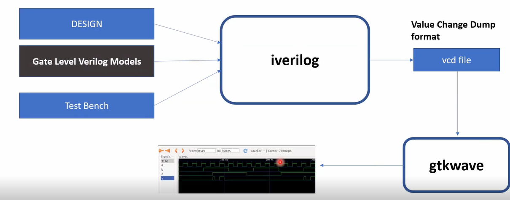
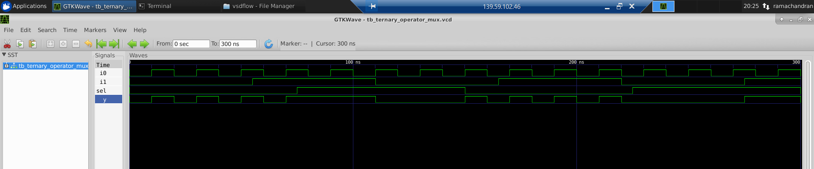
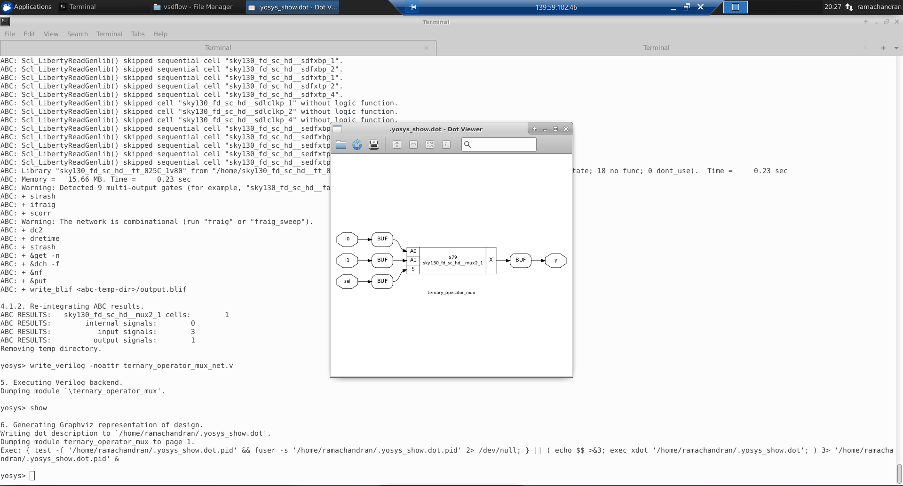
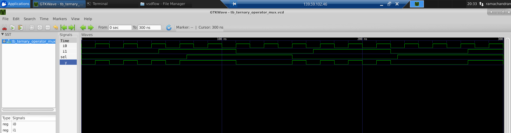
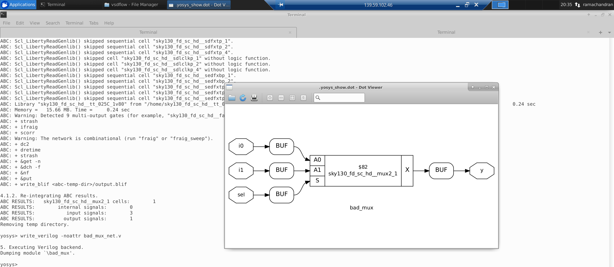
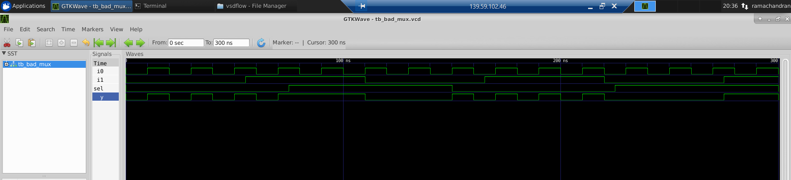
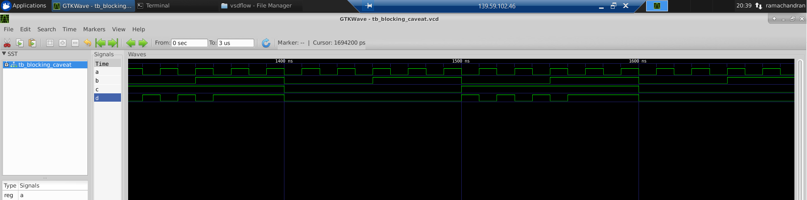
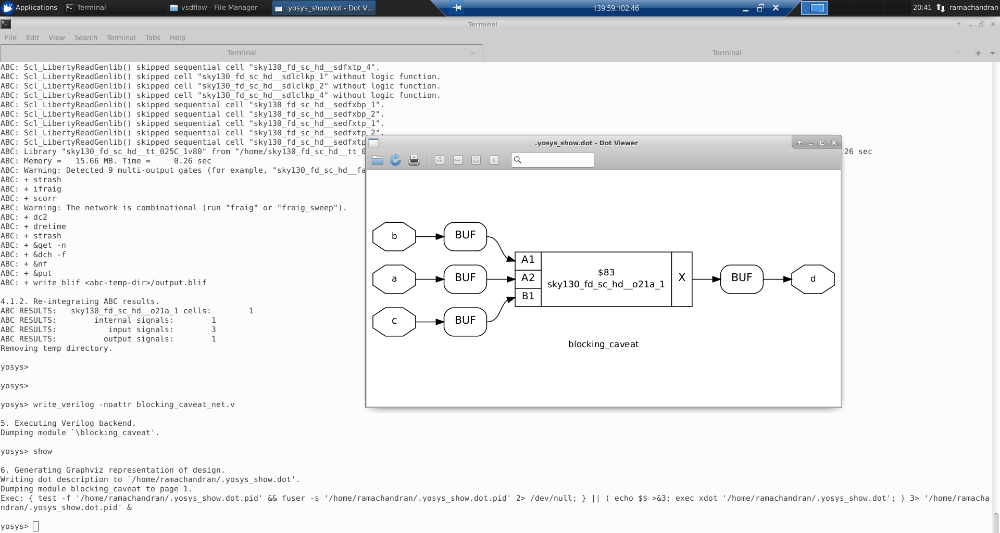
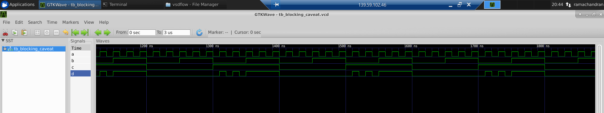

<h2> Day 4 - GLS, blocking vs non-blocking and Synthesis-Simulation mismatch. </h2>

In this section we will look into the Synthesis simulation mismatches that can occur due some bugs in the verilog code. Thus to avoid these we perform a GLS or gate level simulation to the netlist file which is being generated. The key here is that we can use the same test bench code to test the netlist also.

The GLS flow is as below.



The RTL code is synthesized into a netlist code by using Yosys synthesizer. The synthesizer uses Sky130 PDK to convert behavioral code in RTL to netlist. This netlist along with the test bench and verilog models in the PDK are fed to iverilog simulator. This is simulated and sent as VCD file which can be viewed using gtkwave.

<h4> Example </h4>

To perform GLS simulation after synthesis the netlist file is written using write_verilog command and then below commands are use.

```
iverilog ../my_lib/verilog_model.primitives.v ../my_lib/verilog_model/sky130_fd_sc_hd.v <verilog_netlist> <test_bench>

./a.out

gtkwave <.vcd file>
```
The GLS of ternary operator is shown below.

```
//ternary_operator_mux.v
module ternary_operator_mux (input i0 , input i1 , input sel , output y);
        assign y = sel?i1:i0;
        endmodule
```
The iverilog simulation



Yosys synthesized netlist



GLS



<h2> Synthesis Simulation mismatch </h2>

The synthesis simulation mismatch can occur due to missing sensitivity list or blocking and non blocking statements.

<h4> Due to missing sensitivity list </h4>

```
//bad_mux.v
module bad_mux (input i0 , input i1 , input sel , output reg y);
always @ (sel)
begin
        if(sel)
                y <= i1;
        else
                y <= i0;
end
endmodule

```

In the above verilog code we have used sel as the only element in sensitivity list. So when sel is 0 the i0 is outputed,but the problem here is that when i0 changes it is not reflected as sensitivity list does not have those elements. This causes varied results in simulation and synthesis.

The iverilog simulation shows the described problem.


The yosys netlist is shown below.



The GLS shows the mismatch.



<h4> Due to blocking statements </h4>

```
//blocking_caveat.v
module blocking_caveat (input a , input b , input  c, output reg d);
reg x;
always @ (*)
begin
        d = x & c;
        x = a | b;
end
endmodule

```
The blocking statements are executed in the order in whihc they are written in verilog. In the above code, first and is performed followed by OR. Here the problem is that the x value is used before defined and so the previous value is latched up and used to calculation and so the simulation shows value of 1 at 1500ns even when the a and b values are 0 making x as 0. Here the previous 1 in x is latched and used for calculation with c.

The iverilog simulation is shows the error.



The netlist 



GLS



Here the GLS works correctly and differs from RTL simulation.

