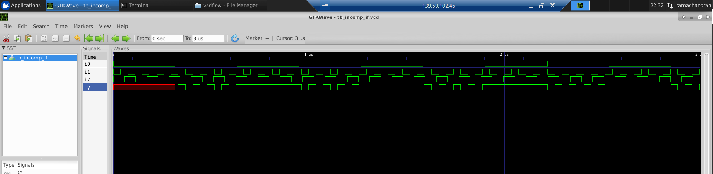

<h2> Day 5 - If, case, for loop and for generate </h2>

This section covers the details about if condition, case statements, for loop and for generate loop in verilog and synthesis. The below sections also covers mainly the Simulation discrepancy while using the above.

<h2> Simulation discrepancy due to incomplete if </h2>

<h4> Example 1 </h4>

```
//incomp_if.v
module incomp_if (input i0 , input i1 , input i2 , output reg y);
always @ (*)
begin
        if(i0)
                y <= i1;
end
endmodule

```

In the above code else statement is missing which causes the previous value y to be retained to satisfy the condition when i0 = 0

The simulation results shows when i0=0 the output previous value of i1 and stays there.



On synthesis we can clearly see a latch.


<h4> Example 2 </h4>

```
//incomp_if2.v
module incomp_if2 (input i0 , input i1 , input i2 , input i3, output reg y);
always @ (*)
begin
        if(i0)
                y <= i1;
        else if (i2)
                y <= i3;

end
endmodule

```

Here we didn't use an else condition and so the output waveform will be latching the previous value of i1 or i3 which ever came before.


The netlist shows a latch.


<h2> Case statement example </h2>

```
//comp_case.v
module comp_case (input i0 , input i1 , input i2 , input [1:0] sel, output reg y);
always @ (*)
begin
        case(sel)
                2'b00 : y = i0;
                2'b01 : y = i1;
                default : y = i2;
        endcase
end
endmodule
```
Simulation result.


The netlist


<h2>Simulation discrepancy due to overlapping case </h2>

```
//bad_case.v
module bad_case (input i0 , input i1, input i2, input i3 , input [1:0] sel, output reg y);
always @(*)
begin
        case(sel)
                2'b00: y = i0;
                2'b01: y = i1;
                2'b10: y = i2;
                2'b1?: y = i3;
                //2'b11: y = i3;
        endcase
end

endmodule

```

In the above code we have overlapping case statement problem as we have used a don't care '?' in the last case. This means that when the output is 10 y becomes i2 and then due to don't care that condition is also executed and output becomes i3 making an unstable output.

Simulation result shows the same as below.


The netlist


The synthesis simulated correctly and so there is a mismatch between simulation and synthesis.


<h2> Examples of using for loop </h2>

Instead of using case statement which becomes a large number of cases when the number of bits increases we can use a for loop for reducing the code.

The for loop is always used inside 'always' block.

<h4> 4X1 Mux </h4>

```
//mux_generate.v
module mux_generate (input i0 , input i1, input i2 , input i3 , input [1:0] sel  , output reg y);
wire [3:0] i_int;
assign i_int = {i3,i2,i1,i0};
integer k;
always @ (*)
begin
for(k = 0; k < 4; k=k+1) begin
        if(k == sel)
                y = i_int[k];
end
end
endmodule

```
Here we use a for loop to select the value of input based on sel. Since we have 2 bits we have 4 inputs to select from.


The netlist 


GLS


<h4> 1X8 Demux </h4>

```
//demux_generate.v
module demux_generate (output o0 , output o1, output o2 , output o3, output o4, output o5, output o6 , output o7 , input [2:0] sel  , input i);
reg [7:0]y_int;
assign {o7,o6,o5,o4,o3,o2,o1,o0} = y_int;
integer k;
always @ (*)
begin
y_int = 8'b0;
for(k = 0; k < 8; k++) begin
        if(k == sel)
                y_int[k] = i;
end
end
endmodule

```

Simulation 


Netlist


GLS


<h2> Example of using For generate </h2>

The for generate is used for instantiation of hardware circuit and always used outside the 'always' statements.

<h4> Ripple carry adder for summing 8 bits </h4>

```
//rca.v
module rca (input [7:0] num1 , input [7:0] num2 , output [8:0] sum);
wire [7:0] int_sum;
wire [7:0]int_co;

genvar i;
generate
        for (i = 1 ; i < 8; i=i+1) begin
                fa u_fa_1 (.a(num1[i]),.b(num2[i]),.c(int_co[i-1]),.co(int_co[i]),.sum(int_sum[i]));
        end

endgenerate
fa u_fa_0 (.a(num1[0]),.b(num2[0]),.c(1'b0),.co(int_co[0]),.sum(int_sum[0]));


assign sum[7:0] = int_sum;
assign sum[8] = int_co[7];
endmodule


```

```
//fa.v
module fa (input a , input b , input c, output co , output sum);
        assign {co,sum}  = a + b + c ;
endmodule
          
```

Simulation


Netlist 


GLS

