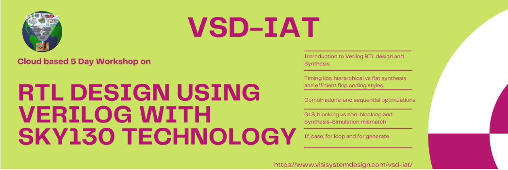

# RTL design using Verilog with SKy130 technology 

<h1> Workshop,23-27th June 2021 </h1>

<h2> Overview </h2>

 A 5 day workshop on the introduction to RTL synthesis and design using the Sky130 open source PDK conducted by VSD IAT on the cloud. 

 Throughout the five days, the workshop dives into a following different concepts 

<OL>
    <LI>Day 1 - Introduction to Verilog RTL and Synthesis. </LI>
    <LI>Day 2 -  Timing libs, hierarchical vs flat synthesis and efficient flop coding styles.</LI>
    <LI>Day 3 - Combinational and sequential optmizations. </LI>
    <LI>Day 4 - GLS, blocking vs non-blocking and Synthesis-Simulation mismatch. </LI>
    <LI>Day 5 - If, case, for loop and for generate. </LI>    
</OL>

<h2> Note: </h2>

The workshop report for each day is the particular folders.
